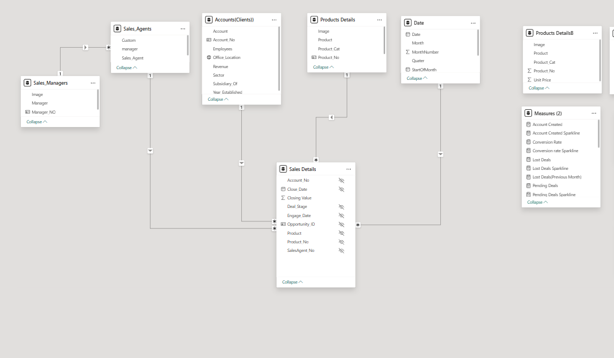
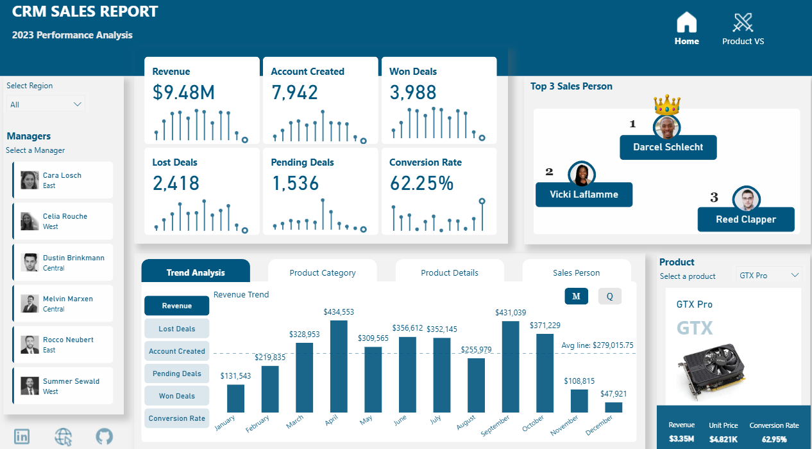
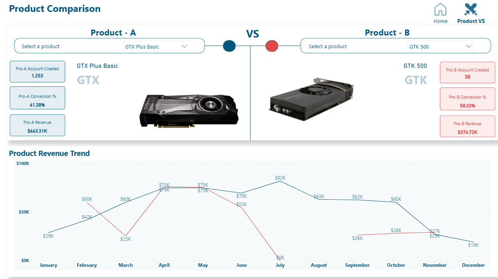
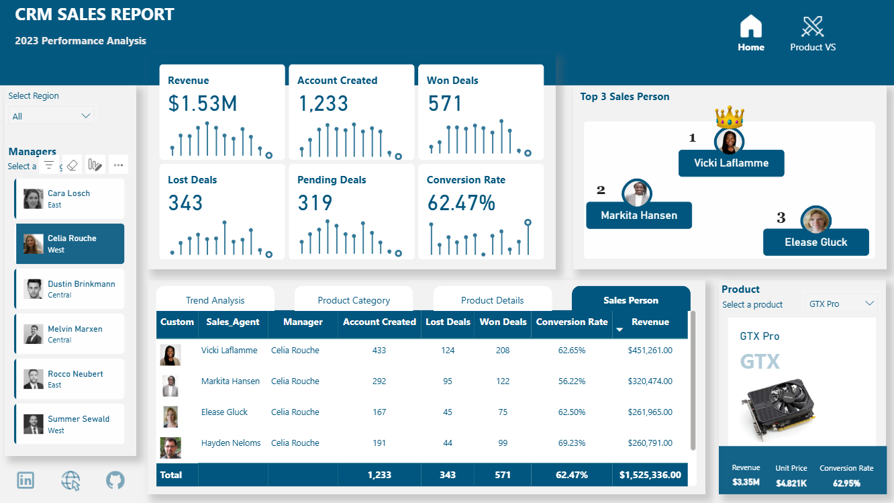

# 📊 CRM Sales Report Dashboard

## 🧭 Introduction  
This project presents an interactive **CRM Sales Report Dashboard** designed to track sales performance, monitor deal progress, and compare product efficiency.  
The dashboard provides real-time insights into revenue generation, deal conversions, and salesperson performance — enabling better strategic decision-making.

---

## ⚙️ Problem Statement  
Businesses often struggle to efficiently monitor and interpret their sales performance across multiple regions, managers, and products.  
Without a centralized reporting system, it becomes challenging to:
- Identify top-performing salespeople and products  
- Track lost and pending deals  
- Evaluate conversion rates over time  
- Make data-driven decisions to improve sales outcomes  

This project solves these issues by creating a **centralized CRM dashboard** that consolidates data from various sales activities, giving stakeholders an easy-to-understand visualization of business performance.

---

## 💡 Skills Demonstrated  
- **Data Cleaning & Transformation** (Power Query / SQL)  
- **Data Modeling** (Power BI DAX)  
- **Dashboard Design & Visualization** (Power BI)  
- **Analytical Thinking & Storytelling**  
- **Business Performance Analysis**  
- **Data-Driven Decision Support**

---

## 🗂️ Data Source  
The dataset used in this dashboard was derived from a simulated CRM system containing:
- Sales transactions  
- Customer account records  
- Deal tracking data  
- Product performance metrics  

Data was imported into **Power BI** from structured **Excel/CSV files** for dynamic reporting and visualization.

---

## 🔄 Data Transformation  
Data preparation and transformation were performed using **Power Query**, including:
- Data cleaning and formatting  
- Removing duplicates and null values  
- Merging sales and customer datasets  
- Creating calculated columns for KPIs such as:
  - `Conversion Rate`
  - `Total Revenue`
  - `Deals by Status`
- Aggregating data by region, manager, and product  

---

## 🧩 Data Model Documentation

A **Star Schema** design was implemented to optimize query performance, support scalability, and enable efficient reporting in Power BI.

---

### ⚙️ Fact Table

### **`Sales Details`**
This is the **central fact table** containing all transactional and sales performance data.

**Key Columns**
- `Account_No` → links to **Accounts(Clients)**
- `Product_No` → links to **Products Details**
- `SalesAgent_No` → links to **Sales Agents**
- `Close Date` / `Engage Date` → links to **Date** dimension
- `Opportunity_ID`, `Closing Value`, `Deal Stage` — core KPIs and deal-level metrics

---
## 🧱 Dimension Tables (Summary)

#### **`Accounts(Clients)`**
- Represents customer or client organizations.  
- **Key Fields:** `Account_No`, `Office_Location`, `Revenue`, `Sector`, `Year_Established`  
- **Purpose:** Enables segmentation and customer-level insights.  

---

#### **`Products Details`**
- Contains product information and categories.  
- **Key Fields:** `Product_No`, `Product`, `Product_Cat`, `Image`  
- **Purpose:** Supports product-level analysis and performance tracking.  
> *Includes a secondary table `Products DetailsB` with pricing (`Unit Price`).*

---

#### **`Sales Agents`**
- Details of individual sales representatives.  
- **Key Fields:** `SalesAgent_No`, `Sales_Agent`, `Manager`, `Custom`  
- **Purpose:** Tracks agent performance and links to managers.  

---

#### **`Sales Managers`**
- Contains information on sales team managers.  
- **Key Fields:** `Manager_No`, `Manager`, `Image`  
- **Purpose:** Enables hierarchical and team-level performance reporting.  

---

#### **`Date`**
- Standard time dimension for trend and period analysis.  
- **Key Fields:** `Date`, `Month`, `Quarter`, `StartOfMonth`  
- **Purpose:** Facilitates time-based reporting and comparisons.  

  

---

## 📈 Analysis & Visualization  
The dashboard is divided into two pages:

### **1. CRM Sales Overview**
- Displays key metrics like total revenue, conversion rate, and deal performance.  
- Highlights top 3 salespeople and regional manager performance.  
- Includes a monthly revenue trend chart.

### **2. Product Comparison Page**
- Compares products based on revenue, account creation, and conversion rate.  
- Displays side-by-side performance analysis across time.

**Key Insights:**
- 💰 **Total Revenue:** $9.48M  
- ⚡ **Conversion Rate:** 62.25%  
- 🏆 **Top Salesperson:** Darcel Schlecht  
- ⭐ **Best Product:** GTX Pro  

  
   
  

#### Click here     
---

## 🧠 Conclusion  
The CRM Sales Dashboard consolidates multiple data sources into a single reporting platform.  
It enables management to:
- Track performance in real-time  
- Identify growth opportunities  
- Understand deal bottlenecks  
- Promote data-driven decision-making  

---

## 🚀 Recommendations  
- Replicate strategies used by top performers (e.g., Darcel Schlecht)  
- Investigate causes of lost deals and address customer concerns  
- Promote high-performing products (e.g., GTX Pro) in other regions  
- Conduct monthly performance reviews using this dashboard  

---

## 🧰 Tools Used  
| Tool | Purpose |
|------|----------|
| **Power BI** | Data visualization and dashboard creation |
| **Power Query** | Data cleaning and transformation |
| **DAX (Data Analysis Expressions)** | Calculations and measures |
| **Excel / CSV** | Source data import |

---

## 🏁 Outcome  
This project showcases my ability to design, model, and visualize CRM data efficiently.  
The dashboard provides stakeholders with actionable insights that drive performance and growth.

---

⭐ **If you like this project, don’t forget to star this repository!**
